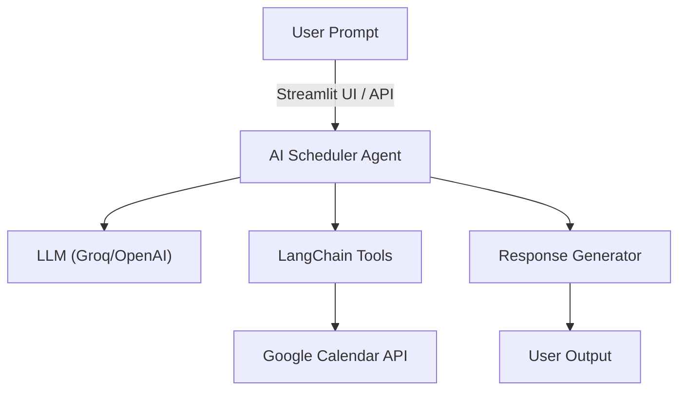

# 🗓️ AI Scheduler Agent

[](https://www.python.org/)
[]
[]
[]
[](LICENSE)

---

## 🌟 Introduction

**AI Scheduler Agent** is a modern, context-aware calendar assistant powered by advanced LLMs, LangChain, and the Google Calendar API. It features a beautiful dark theme UI, remembers your last 8 messages for context, and supports powerful scheduling tools.

### **Key Highlights**
- 🖤 Beautiful dark theme UI (Streamlit)
- 🧠 Short-term memory: Remembers last 8 messages for context
- 🔗 Integrates with Google Calendar for real-time event management
- 🛠️ Dynamic tools: search, move, batch delete, duration, free/busy, quick add, and more
- 📅 Reads, creates, updates, deletes, and searches events and reminders
- 🕒 Answers questions about your schedule and availability
- 🌐 Multi-modal: works via Streamlit UI and REST API

---

## 🏗️ Architecture



---

## 🚀 Features

- **Smart Scheduling:** Add, update, move, and delete events in Google Calendar
- **Batch Actions:** Delete or move multiple events in a time range
- **Event Search:** Find events by keyword, get event details
- **Calendar Insights:** Query your schedule, upcoming events, and availability
- **Reminders & Automation:** Set reminders and automate routine scheduling
- **Free/Busy:** See your free/busy slots for any day
- **Quick Add:** Add events with a single natural language string
- **Short-term Memory:** Remembers last 8 messages for context-aware conversations
- **Easy to Use:** Streamlit UI (dark mode) and REST API endpoints

---

## 🏁 Getting Started

### 1. **Clone the Repository**
```sh
git clone https://github.com/harmish/agentic_ai_project.git
cd agentic_ai_project/AI_schedular
```

### 2. **Set Up the Environment**
Install [uv](https://github.com/astral-sh/uv) (fast Python package manager):
```sh
pip install uv
```
Create and activate a virtual environment:
```sh
uv venv env --python cpython-3.10.18-windows-x86_64-none
.\env\Scripts\activate
```

### 3. **Install Dependencies**
```sh
uv pip install -r requirements.txt
```

### 4. **Configure API Keys and Google Calendar**
Copy `.env.example` to `.env` and fill in your API keys:
```sh
cp .env.example .env
```
Edit `.env` and set:
```
GROQ_API_KEY=your_groq_api_key
OPENAI_API_KEY=your_openai_api_key
```
**Google Calendar Setup:**
1. Go to the [Google Cloud Console](https://console.cloud.google.com/apis/credentials) and create OAuth2 credentials for a Desktop app.
2. Download the `credentials.json` file and place it in your project root.
3. The first time you use a calendar tool, a browser window will open for you to authorize access to your Google Calendar. A `token.pickle` file will be created for future use.

---

## 💡 Example Usage & Testing

Try these commands in the UI:
- `Schedule a meeting with Alice at 2pm tomorrow.`
- `Delete all events between 2-7pm from tomorrow onwards.`
- `Find all events with the word "review" in the title.`
- `Show details for my 3pm meeting on Friday.`
- `When am I free next Thursday?`
- `How many hours of meetings do I have this week?`
- `Quick add: Call with John at 5pm Friday.`

The agent will remember context for up to 8 messages, so you can follow up with:
- `Now move them to 4pm.`
- `Delete those events too.`

---

## ⚠️ Common Issues

- **API Key Errors:** Ensure all API keys are correct and enabled for the required services.
- **API Quotas:** Some APIs have free tier limits; exceeding them may cause failures.
- **Network Issues:** Check your internet connection if API calls fail.
- **Google API Authorization:** Make sure the required APIs are enabled in your Google Cloud project.

---

## 📚 Documentation & References

- [LangChain Documentation](https://python.langchain.com/)
- [Streamlit Documentation](https://docs.streamlit.io/)
- [Google Calendar API](https://developers.google.com/calendar/api/v3/reference)

---

## 🔒 Security Notes

- **Never commit your `.env` file or API keys to public repositories.**
- **Regenerate your API keys if you suspect they are compromised.**
- **Restrict API keys to only the services and domains you need.**
- **Review third-party API usage and privacy policies.**

---

Enjoy managing your schedule with the AI Scheduler Agent! 🗓️